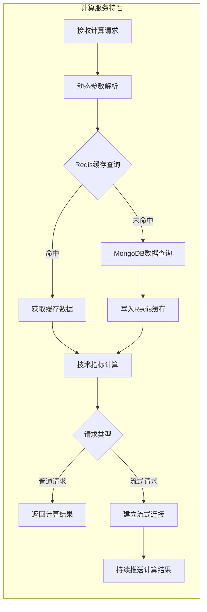

# OKEx WebSocket 蜡烛数据处理系统 PRD

## 变更记录
| 版本 | 日期 | 变更内容 | 变更人 |
|------|------|----------|--------|
| 1.0  | 2023-12-25 | 创建文档 | 产品经理 |

## 1. 项目概述

### 1.1 项目背景
构建一个基于WebSocket客户端技术的数据处理系统，通过OKEx WebSocket API订阅交易对蜡烛图数据，并存储到Mongodb，支持gRPC调用实时计算技术指标。

## 2. 功能需求

### 2.1 核心功能

#### 2.1.1 WebSocket连接管理
- 建立与OKEx WebSocket的稳定连接，连接地址：`wss://ws.okx.com:8443/ws/v5/business`
- 实现自动重连机制
- 连接状态监控和异常处理：
  - 实现连接状态查询接口，支持查询当前连接状态、历史连接记录和异常信息
  - 独立开发VUE管理台项目，提供可观测性展示：
    - WebSocket连接状态
    - 重连记录
- 心跳检测机制：
  - 为保持连接有效稳定，需实现：
    - 每次接收消息后设置定时器（N秒，N < 30）
    - 若定时器触发（N秒内无新消息），发送字符串'ping'
    - 期待'pong'回应，若N秒内未收到则报错或重新连接

#### 2.1.2 数据订阅功能
- 支持多交易对订阅：BTC-USDT-SWAP, ETH-USDT-SWAP
- 支持多时间维度：1m (1分钟), 1H (1小时)
- 可配置的交易对列表
- 可配置的时间维度列表
- 订阅方式参考文档地址：`https://www.okx.com/docs-v5/zh/#order-book-trading-market-data-ws-candlesticks-channel`

#### 2.1.3 蜡烛数据处理
- 实时接收和解析蜡烛图数据
- 数据格式标准化
- 数据验证和清洗
- 时间戳统一处理
- 存储到MongoDB

### 2.2 技术指标计算

#### 2.2.1 支持的技术指标
- **RSI (相对强弱指数)**: gRPC服务端接收到计算请求时，提供周期参数（n），默认值为14。
  
  RSI算法使用以下公式计算：
  
  1. 计算每个周期的价格变动：
     \[ Change = Close_t - Close_{t-1} \]
  
  2. 分别计算上涨和下跌的平均：
     \[ U = \frac{1}{n} \sum_{i=1}^{n} \max(Change_i, 0) \]
     \[ D = \frac{1}{n} \sum_{i=1}^{n} \max(-Change_i, 0) \]
  
  3. 计算相对强弱：
     \[ RS = \frac{U}{D} \]
  
  4. 计算RSI：
     \[ RSI = 100 - \frac{100}{1 + RS} \]
  
  对于持续计算，使用指数移动平均(EMA)平滑：
  
  \[ U_t = \frac{(n-1)U_{t-1} + \max(Change_t, 0)}{n} \]
  \[ D_t = \frac{(n-1)D_{t-1} + \max(-Change_t, 0)}{n} \]

- **BOLL (布林带)**: gRPC服务端接收到计算请求时，提供周期参数（n）和标准差参数（m），默认值分别为20和2。
  
  BOLL算法使用以下公式计算：
  
  1. 计算移动平均线（MA）：
     \[ MA = \frac{1}{n} \sum_{i=1}^{n} Close_i \]
  
  2. 计算标准差（σ）：
     \[ \sigma = \sqrt{\frac{1}{n} \sum_{i=1}^{n} (Close_i - MA)^2} \]
  
  3. 计算上轨（Upper Band）：
     \[ Upper Band = MA + m \times \sigma \]
  
  4. 计算下轨（Lower Band）：
     \[ Lower Band = MA - m \times \sigma \]
- **MACD (移动平均收敛散度)**: gRPC服务端接收到计算请求时，提供快线周期参数（n_fast）、慢线周期参数（n_slow）和信号线周期参数（n_signal），默认值分别为12、26和9。
  
  MACD算法使用以下公式计算：
  
  1. 计算快线EMA（EMA_fast）：
     \[ EMA_{fast} = \frac{Close_t \times 2 + EMA_{fast, t-1} \times (n_{fast} - 1)}{n_{fast} + 1} \]
  
  2. 计算慢线EMA（EMA_slow）：
     \[ EMA_{slow} = \frac{Close_t \times 2 + EMA_{slow, t-1} \times (n_{slow} - 1)}{n_{slow} + 1} \]
  
  3. 计算MACD线：
     \[ MACD = EMA_{fast} - EMA_{slow} \]
  
  4. 计算信号线（Signal Line）：
     \[ Signal Line = \frac{MACD_t \times 2 + Signal Line_{t-1} \times (n_{signal} - 1)}{n_{signal} + 1} \]
  
  5. 计算MACD柱状图（Histogram）：
     \[ Histogram = MACD - Signal Line \]

- **十字针（Pinbar）识别**: gRPC服务端接收到计算请求时，提供实体比例阈值（body_ratio_threshold）和影线比例阈值（wick_ratio_threshold），默认值分别为0.2和0.6。
  
  十字针识别基于单项蜡烛图数据(o,c,h,l)进行判断，算法使用以下条件：
  
  1. 计算蜡烛图的实体长度：
     \[ Body Length = |c - o| \]
  
  2. 计算蜡烛图的总长度：
     \[ Total Length = h - l \]
  
  3. 计算实体比例：
     \[ Body Ratio = \frac{Body Length}{Total Length} \]
  
  4. 计算上影线和下影线长度：
     - 对于看涨十字针（Pinbar Bullish）：
       \[ Upper Wick = h - max(o, c) \]
       \[ Lower Wick = min(o, c) - l \]
       \[ Main Wick = Lower Wick \]
       \[ Secondary Wick = Upper Wick \]
     
     - 对于看跌十字针（Pinbar Bearish）：
       \[ Upper Wick = h - max(o, c) \]
       \[ Lower Wick = min(o, c) - l \]
       \[ Main Wick = Upper Wick \]
       \[ Secondary Wick = Lower Wick \]
  
  5. 计算主要影线比例：
     \[ Main Wick Ratio = \frac{Main Wick}{Total Length} \]
  
  6. 十字针识别条件：
     - 实体比例小于等于实体比例阈值：
       \[ Body Ratio \leq body\_ratio\_threshold \]
     
     - 主要影线比例大于等于影线比例阈值：
       \[ Main Wick Ratio \geq wick\_ratio\_threshold \]
     
     - 次要影线相对较短（通常小于总长度的10%）：
       \[ Secondary Wick \leq 0.1 \times Total Length \]
  
  当满足以上所有条件时，蜡烛图被识别为十字针形态，并根据开盘价和收盘价的关系确定是看涨还是看跌十字针。

#### 2.2.2 计算服务特性
- 从Redis缓存中查找，未命中则从MongoDB查询指定交易对、时间维度和时间范围的蜡烛图数据列表，写入缓存，输出计算结果
- 支持动态参数配置（周期、系数等）
- 支持流式计算结果推送

### 2.3 数据服务功能

#### 2.3.1 gRPC服务接口
- 提供实时技术指标计算服务
- 支持自定义参数的计算请求
- 基于gRPC的高性能RPC调用
- 支持流式和一元调用

#### 2.3.2 数据存储和缓存
- MongoDB存储原始蜡烛图数据
- Redis缓存计算结果
- 缓存过期策略管理
- 数据一致性保证

#### 2.3.3 gRPC服务特性
- 高性能二进制协议传输
- 支持双向流式通信
- 自动代码生成
- 强类型接口定义
- 跨语言客户端支持

## 3. 非功能需求

### 3.1 性能要求
- 数据处理延迟：< 20ms
- WebSocket消息处理：> 1000条/秒
- 内存占用：< 512MB

### 3.2 可靠性要求
- 系统可用性：99.9%
- 数据完整性：零丢失
- 自动重连：网络中断后5秒内重连
- 异常恢复：组件异常不影响整体运行

### 3.3 可扩展性要求
- 支持新交易对动态添加
- 支持新时间维度配置
- 组件热插拔能力

## 7. 项目时间线

### 7.1 开发阶段
- **阶段1（1周）：基础架构搭建**
  - 项目结构初始化
  - 完成依赖管理配置
  - 开发环境搭建和工具配置
  
- **阶段2（1周）：WebSocket连接管理开发**
  - WebSocket客户端实现（连接地址：wss://ws.okx.com:8443/ws/v5/business）
  - 自动重连机制开发
  - 心跳检测机制实现（ping/pong机制）
  - 连接状态监控接口开发
  
- **阶段3（1周）：数据订阅与处理**
  - 多交易对、多时间维度订阅功能
  - 蜡烛图数据实时接收和解析
  - 数据格式标准化和验证
  - MongoDB数据存储实现
  
- **阶段4（2周）：技术指标计算模块开发**
  - RSI算法实现
  - BOLL算法实现
  - MACD算法实现
  - Pinbar（十字针）识别算法实现
  
- **阶段5（1周）：数据服务层开发**
  - Protocol Buffers定义（包含所有技术指标接口）
  - gRPC服务端实现
  - 支持流式和一元调用模式
  - 计算服务特性实现（缓存查询、动态参数解析等）
  
- **阶段6（1周）：缓存系统集成**
  - Redis缓存机制实现
  - 缓存过期策略配置
  - 数据一致性保证机制
  
- **阶段7（1周）：管理台和监控系统开发**
  - VUE管理台项目搭建
  - WebSocket连接状态实时监控面板
  - 异常事件日志和告警展示
  - 系统运行状态仪表盘
  
- **阶段8（1周）：集成测试和性能优化**
  - 模块间集成测试
  - 性能测试和优化（满足延迟<20ms等要求）
  - 可靠性测试（重连、异常恢复等）
  - 文档完善

### 7.2 里程碑
- **M1：基础框架完成** - 项目结构搭建完成，依赖配置就绪
- **M2：WebSocket连接功能实现** - 成功连接OKEx WebSocket，支持自动重连和心跳检测
- **M3：数据订阅与存储完成** - 实现多交易对数据订阅，蜡烛图数据正确存储
- **M4：技术指标计算完成** - 所有技术指标（RSI、BOLL、MACD、Pinbar）算法实现并通过验证
- **M5：gRPC服务上线** - 数据服务层完成，支持流式和一元调用
- **M6：缓存系统集成完成** - Redis缓存机制实现，提升系统性能
- **M7：管理台功能完成** - VUE管理台项目上线，提供完整的可观测性展示
- **M8：系统验收通过** - 集成测试通过，满足所有性能和可靠性要求