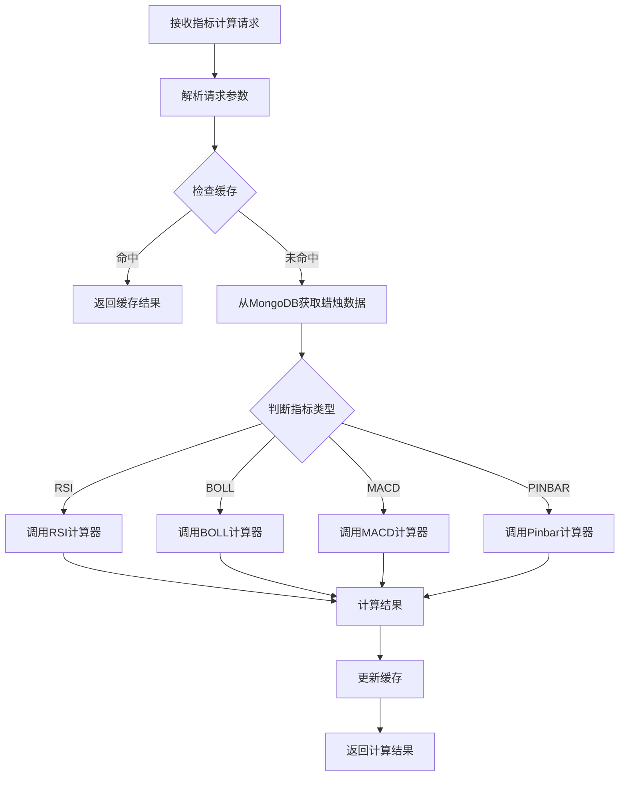

# OKEx WebSocket 数据处理系统架构文档

## 1. 项目概述

### 1.1 技术栈

| 分类 | 技术 | 版本/说明 |
|------|------|-----------|
| 开发语言 | Java | 8 (JDK 1.8) |
| 构建工具 | Maven | 3.x |
| 数据源 | OKEx WebSocket API | 实时行情数据 |
| 数据库 | MongoDB | 存储蜡烛图数据 |
| 缓存 | Redis | 技术指标计算结果缓存 |
| RPC框架 | gRPC | 服务间通信 |
| 序列化 | Protocol Buffers | 高效数据传输 |
| WebSocket客户端 | Spring WebSocket | 基于标准Java EE WebSocket API的客户端实现 |
| 框架 | Spring Boot | 2.x (≥4.3) |
| 代码简化 | Lombok | 用于简化代码（@RequiredArgsConstructor等） |
| JSON处理 | Jackson | 数据格式转换 |
| 日志 | SLF4J | 日志记录API |

## 2. 项目结构

### 2.1 Maven多模块工程结构

```
okex-trans-5/
├── pom.xml                           # 父工程POM
├── okex-common/                      # 公共模块
│   ├── pom.xml
│   └── src/main/java/com/okex/common/
│       ├── proto/                    # Protocol Buffers定义
│       ├── model/                    # 数据模型
│       ├── util/                     # 工具类
│       └── exception/                # 异常定义
├── okex-server/                      # 服务端模块
│   ├── pom.xml
│   └── src/main/java/com/okex/server/
│       ├── grpc/                     # gRPC服务实现
│       ├── service/                  # 业务服务
│       ├── processor/                # 技术指标计算器
│       ├── storage/                  # 数据存储
│       ├── config/                   # 配置管理
│       └── websocket/                # WebSocket客户端
└── okex-client/                      # 客户端模块
    ├── pom.xml
    └── src/main/java/com/okex/client/
        ├── grpc/                     # gRPC客户端
        ├── service/                  # 客户端服务
        └── example/                  # 使用示例
```

## 3. 模块详细设计

### 3.1 父工程 (okex-trans-5)

#### 3.1.1 Maven配置
父工程使用Maven管理多模块项目，主要职责包括：
- 定义项目基本信息（groupId、artifactId、version）
- 管理所有模块的依赖版本，确保版本一致性
- 配置公共插件（Protocol Buffers编译插件、Maven编译插件等）
- 定义子模块列表（okex-common、okex-server、okex-client）

关键依赖包括：gRPC、Protocol Buffers、Spring Boot（版本2.x，需≥4.3）、Spring WebSocket、MongoDB、Redis、Jackson、Lombok（用于简化代码，提供@RequiredArgsConstructor等注解）等。

### 3.2 公共模块 (okex-common)

#### 3.2.1 Maven配置
okex-common模块是项目的公共模块，提供共享的模型和工具类。

主要依赖：
- Protocol Buffers（序列化框架）
- Jackson（JSON处理）
- SLF4J（日志API）

该模块包含项目中使用的通用模型、枚举和工具类，供其他模块依赖使用。

#### 3.2.2 Protocol Buffers定义

```protobuf
// 文件路径: okex-common/src/main/proto/indicator.proto
syntax = "proto3";

package com.okex.common.proto;

option java_package = "com.okex.common.proto";
option java_outer_classname = "IndicatorServiceProto";

service IndicatorService {
  // RSI计算
  rpc CalculateRSI(RSIRequest) returns (IndicatorResponse);
  
  // 批量RSI计算
  rpc CalculateRSIBatch(BatchRSIRequest) returns (stream IndicatorResponse);
  
  // 布林带计算
  rpc CalculateBOLL(BOLLRequest) returns (IndicatorResponse);
  
  // 批量布林带计算
  rpc CalculateBOLLBatch(BatchBOLLRequest) returns (stream IndicatorResponse);
  
  // MACD计算
  rpc CalculateMACD(MACDRequest) returns (IndicatorResponse);
  
  // 批量MACD计算
  rpc CalculateMACDBatch(BatchMACDRequest) returns (stream IndicatorResponse);
  
  // 十字针(Pinbar)计算
  rpc CalculatePinbar(PinbarRequest) returns (IndicatorResponse);
  
  // 批量十字针(Pinbar)计算
  rpc CalculatePinbarBatch(BatchPinbarRequest) returns (stream IndicatorResponse);
  
  // 实时指标流
  rpc StreamIndicators(StreamRequest) returns (stream IndicatorResponse);
}

// 基础请求结构
message BaseRequest {
  string symbol = 1;
  string interval = 2;
  int32 limit = 3;
}

// RSI请求
message RSIRequest {
  BaseRequest base = 1;
  int32 period = 2;
}

// 批量RSI请求
message BatchRSIRequest {
  repeated RSIRequest requests = 1;
}

// 布林带请求
message BOLLRequest {
  BaseRequest base = 1;
  int32 period = 2;
  double std_dev = 3;
}

// 批量布林带请求
message BatchBOLLRequest {
  repeated BOLLRequest requests = 1;
}

// MACD请求
message MACDRequest {
  BaseRequest base = 1;
  int32 fast_period = 2;
  int32 slow_period = 3;
  int32 signal_period = 4;
}

// 批量MACD请求
message BatchMACDRequest {
  repeated MACDRequest requests = 1;
}

// 十字针(Pinbar)请求
message PinbarRequest {
  BaseRequest base = 1;
  double body_ratio_threshold = 2;
  double wick_ratio_threshold = 3;
}

// 批量十字针(Pinbar)请求
message BatchPinbarRequest {
  repeated PinbarRequest requests = 1;
}

// 流式请求
message StreamRequest {
  string symbol = 1;
  string interval = 2;
  repeated IndicatorType indicators = 3;
}

enum IndicatorType {
  RSI = 0;
  BOLL = 1;
  MACD = 2;
  PINBAR = 3;
}

// 指标响应
message IndicatorResponse {
  bool success = 1;
  string error_message = 2;
  string symbol = 3;
  IndicatorType indicator_type = 4;
  string interval = 5;
  int64 timestamp = 6;
  int32 data_points = 7;
  bool from_cache = 8;
  
  // RSI结果
  optional double rsi_value = 10;
  
  // 布林带结果
  optional double boll_upper = 11;
  optional double boll_middle = 12;
  optional double boll_lower = 13;
  
  // MACD结果
  optional double macd_line = 14;
  optional double macd_signal = 15;
  optional double macd_histogram = 16;
  
  // 十字针(Pinbar)结果
  optional bool is_pinbar = 17;
  optional bool is_bullish = 18;
  optional double body_ratio = 19;
  optional double upper_wick_ratio = 20;
  optional double lower_wick_ratio = 21;
}
```

#### 2.2.3 数据模型

```java
// 文件路径: okex-common/src/main/java/com/okex/common/model/Candle.java

public class Candle {
    private String symbol;
    private Instant timestamp;
    private String interval;
    private double open;
    private double high;
    private double low;
    private double close;
    private double volume;
    private String confirm;
    private Instant createdAt;
  
    // 构造函数、getter、setter
}

// 文件路径: okex-common/src/main/java/com/okex/common/model/IndicatorResult.java
public class IndicatorResult {
    private Double value;
    private Map<String, Double> values;
    private String timestamp;
    private Integer dataPoints;
  
    // 构造函数、getter、setter
}

// 文件路径: okex-common/src/main/java/com/okex/common/model/IndicatorParams.java
public class IndicatorParams {
    private Map<String, Object> parameters = new HashMap<>();
  
    public void addParameter(String key, Object value) {
        parameters.put(key, value);
    }
  
    public Object getParameter(String key) {
        return parameters.get(key);
    }
  
    // getter、setter
}
```

#### 2.2.4 技术指标接口

```java
// 文件路径: okex-common/src/main/java/com/okex/common/indicator/TechnicalIndicator.java
public interface TechnicalIndicator {
    /**
     * 计算技术指标
     */
    IndicatorResult calculate(java.util.List<Candle> candles, IndicatorParams params);
  
    /**
     * 获取指标名称
     */
    String getName();
}
```

### 2.3 服务端模块 (okex-server)

#### 2.3.1 Maven配置
okex-server模块是项目的核心服务模块，负责WebSocket连接管理、数据处理和gRPC服务提供。

主要依赖：
- okex-common（公共模块）
- Spring Boot（应用框架）
- MongoDB（数据存储）
- Redis（缓存）
- gRPC（远程服务调用）

该模块包含WebSocket客户端、数据存储层、技术指标计算服务和gRPC服务实现。

#### 2.3.2 服务端启动类

```java
// 文件路径: okex-server/src/main/java/com/okex/server/OkexServerApplication.java
@SpringBootApplication(scanBasePackages = {"com.okex.server", "com.okex.common"})
public class OkexServerApplication {
    public static void main(String[] args) {
        SpringApplication.run(OkexServerApplication.class, args);
    }
}
```

#### 2.3.3 系统配置

**配置说明**：
服务端模块使用Spring Boot的配置管理机制，支持通过application.properties或application.yml文件进行配置。主要配置项包括：

**技术指标默认配置**：
| 配置项 | 说明 | 默认值 |
|--------|------|--------|
| `indicator.rsi.default-period` | RSI指标默认周期 | 14 |
| `indicator.boll.default-period` | BOLL指标默认周期 | 20 |
| `indicator.boll.default-std-dev` | BOLL指标默认标准差 | 2.0 |
| `indicator.macd.default-fast-period` | MACD指标默认快线周期 | 12 |
| `indicator.macd.default-slow-period` | MACD指标默认慢线周期 | 26 |
| `indicator.macd.default-signal-period` | MACD指标默认信号线周期 | 9 |
| `indicator.pinbar.default-body-ratio` | Pinbar指标默认实体比例阈值 | 0.2 |
| `indicator.pinbar.default-wick-ratio` | Pinbar指标默认影线比例阈值 | 0.6 |

**缓存配置**：
| 配置项 | 说明 | 默认值 |
|--------|------|--------|
| `cache.ttl.rsi` | RSI指标结果缓存过期时间（秒） | 300 |
| `cache.ttl.boll` | BOLL指标结果缓存过期时间（秒） | 300 |
| `cache.ttl.macd` | MACD指标结果缓存过期时间（秒） | 300 |
| `cache.ttl.pinbar` | Pinbar指标结果缓存过期时间（秒） | 300 |

#### 2.3.4 gRPC服务实现

**功能说明**：
gRPC服务实现负责处理客户端的指标计算请求，从MongoDB获取历史蜡烛数据，调用指标计算引擎计算结果，然后返回给客户端。

**类结构**：
```java
// 文件路径: okex-server/src/main/java/com/okex/server/grpc/IndicatorServiceImpl.java
@GrpcService
@RequiredArgsConstructor
public class IndicatorServiceImpl extends IndicatorServiceGrpc.IndicatorServiceImplBase {
  
    // 依赖注入
    private final CalculationEngine calculationEngine;
    private final CacheService cacheService;
    private final MongoRepository mongoRepository;
  
    @Override
    public void calculateRSI(RSIRequest request, StreamObserver<IndicatorResponse> responseObserver) {
        /* 实现RSI计算服务 */
    }
    
    @Override
    public void calculateRSIBatch(BatchRSIRequest request, StreamObserver<IndicatorResponse> responseObserver) {
        /* 实现批量RSI计算服务 */
    }
    
    @Override
    public void calculateBOLL(BOLLRequest request, StreamObserver<IndicatorResponse> responseObserver) {
        /* 实现布林带计算服务 */
    }
    
    @Override
    public void calculateBOLLBatch(BatchBOLLRequest request, StreamObserver<IndicatorResponse> responseObserver) {
        /* 实现批量布林带计算服务 */
    }
    
    @Override
    public void calculateMACD(MACDRequest request, StreamObserver<IndicatorResponse> responseObserver) {
        /* 实现MACD计算服务 */
    }
    
    @Override
    public void calculateMACDBatch(BatchMACDRequest request, StreamObserver<IndicatorResponse> responseObserver) {
        /* 实现批量MACD计算服务 */
    }
    
    @Override
    public void calculatePinbar(PinbarRequest request, StreamObserver<IndicatorResponse> responseObserver) {
        /* 实现十字针(Pinbar)计算服务 */
    }
    
    @Override
    public void calculatePinbarBatch(BatchPinbarRequest request, StreamObserver<IndicatorResponse> responseObserver) {
        /* 实现批量十字针(Pinbar)计算服务 */
    }
    
    @Override
    public void streamIndicators(StreamRequest request, StreamObserver<IndicatorResponse> responseObserver) {
        /* 实现实时指标流服务 */
    }
}
```

#### 2.3.4 技术指标计算引擎

**功能说明**：
技术指标计算引擎是系统的核心计算组件，负责协调各个技术指标计算器，为上层提供统一的指标计算接口。采用策略模式，根据不同的指标类型调用对应的计算器实现。

**架构流程**：


**类结构**：
```java
// 文件路径: okex-server/src/main/java/com/okex/server/service/CalculationEngine.java
@Service
@RequiredArgsConstructor
public class CalculationEngine {
    // 依赖注入各种指标计算器
    private final RSICalculator rsiCalculator;
    private final BOLLCalculator bollCalculator;
    private final MACDCalculator macdCalculator;
    private final PinbarCalculator pinbarCalculator;
  
    // 核心计算方法
    public IndicatorResult calculateRSI(java.util.List<Candle> candles, IndicatorParams params) {
        /* 调用RSI计算器进行计算 */
    }
  
    public IndicatorResult calculateBOLL(java.util.List<Candle> candles, IndicatorParams params) {
        /* 调用BOLL计算器进行计算 */
    }
  
    public IndicatorResult calculateMACD(java.util.List<Candle> candles, IndicatorParams params) {
        /* 调用MACD计算器进行计算 */
    }
    
    public IndicatorResult calculatePinbar(java.util.List<Candle> candles, IndicatorParams params) {
        /* 调用Pinbar计算器进行计算 */
    }
}
```

#### 2.3.5 技术指标计算器

**功能说明**：
技术指标计算器负责实现各种技术指标的具体计算逻辑。系统采用策略模式，通过实现TechnicalIndicator接口的不同计算器类来支持多种技术指标。

**类结构**：
```java
// 文件路径: okex-server/src/main/java/com/okex/server/processor/RSICalculator.java
@Component
public class RSICalculator implements TechnicalIndicator {
    @Override
    public IndicatorResult calculate(List<Candle> candles, IndicatorParams params) {
        /* 实现RSI（相对强弱指标）计算逻辑 */
    }
    
    @Override
    public String getName() {
        return "RSI";
    }
}

// 文件路径: okex-server/src/main/java/com/okex/server/processor/BOLLCalculator.java
@Component
public class BOLLCalculator implements TechnicalIndicator {
    @Override
    public IndicatorResult calculate(List<Candle> candles, IndicatorParams params) {
        /* 实现BOLL（布林带）计算逻辑 */
    }
    
    @Override
    public String getName() {
        return "BOLL";
    }
}

// 文件路径: okex-server/src/main/java/com/okex/server/processor/MACDCalculator.java
@Component
public class MACDCalculator implements TechnicalIndicator {
    @Override
    public IndicatorResult calculate(List<Candle> candles, IndicatorParams params) {
        /* 实现MACD（指数平滑异同移动平均线）计算逻辑 */
    }
    
    @Override
    public String getName() {
        return "MACD";
    }
}

// 文件路径: okex-server/src/main/java/com/okex/server/processor/PinbarCalculator.java
@Component
public class PinbarCalculator implements TechnicalIndicator {
    @Override
    public IndicatorResult calculate(List<Candle> candles, IndicatorParams params) {
        /* 实现Pinbar（十字针）识别逻辑 */
    }
    
    @Override
    public String getName() {
        return "PINBAR";
    }
}

// 文件路径: okex-server/src/main/java/com/okex/server/processor/MACDCalculator.java
@Component
public class MACDCalculator implements TechnicalIndicator {
    @Override
    public IndicatorResult calculate(List<Candle> candles, IndicatorParams params) {
        /* 实现MACD（指数平滑异同移动平均线）计算逻辑 */
    }
    
    @Override
    public String getName() {
        return "MACD";
    }
}
```

#### 2.3.6 数据存储层

**功能说明**：
数据存储层负责将蜡烛数据持久化到MongoDB数据库，并提供查询接口。采用Repository模式，通过MongoRepository实现CandleRepository接口，封装数据库操作细节。

**数据结构设计**：

```json
{
  "symbol": "BTC-USDT-SWAP",
  "timestamp": "2023-12-25T10:00:00Z",
  "interval": "1m",
  "open": 42000.0,
  "high": 42100.0,
  "low": 41950.0,
  "close": 42050.0,
  "volume": 1250.8,
  "confirm": "1",
  "created_at": "2023-12-25T10:00:01Z"
}
```

**confirm字段说明**:
- "0": 蜡烛图未确认(仍在形成中)
- "1": 蜡烛图已确认(时间周期已完成)
- 对于数据校验和历史分析非常重要,只有confirm="1"的数据才应该用于最终计算

**类结构**：
```java
// 文件路径: okex-server/src/main/java/com/okex/server/storage/MongoRepository.java
package com.okex.server.storage;

@Repository
@RequiredArgsConstructor
public class MongoRepository implements CandleRepository {
    // 核心依赖
    private final MongoClient mongoClient;
    private final MongoDatabase database;
    private final MongoCollection<Document> collection;
    
    // 构造函数 - 依赖注入MongoDB配置
    public MongoRepository(@Value("${mongodb.uri}") String mongoUri,
                          @Value("${mongodb.database}") String databaseName,
                          @Value("${mongodb.collection}") String collectionName) {
        /* 初始化MongoDB连接 */
    }
    
    // 核心方法
    @Override
    public List<Candle> findCandles(String symbol, String interval, int limit) {
        /* 按symbol和interval查询蜡烛数据，支持分页 */
    }
    
    @Override
    public void saveCandle(Candle candle) {
        /* 保存单条蜡烛数据到MongoDB */
    }
    
    @Override
    public void saveCandlesBatch(List<Candle> candles) {
        /* 批量保存蜡烛数据到MongoDB */
    }
}

#### 2.3.7 Redis缓存层

**功能说明**：
Redis缓存层用于缓存技术指标计算结果，避免重复计算，提高系统响应速度。采用键值对存储方式，支持TTL过期机制。

**缓存结构设计**：

```
Key: RSI:BTC-USDT-SWAP:1m:14
Value: {"timestamp": "2023-12-25T10:00:00Z", "value": 65.4, "data_points": 100}
TTL: 30秒

Key: BOLL:BTC-USDT-SWAP:1m:15
Value: {"timestamp": "2023-12-25T10:00:00Z", "upper": 42200.0, "middle": 42000.0, "lower": 41800.0, "data_points": 100}
TTL: 30秒
```

**类结构**：
```java
// 文件路径: okex-server/src/main/java/com/okex/server/cache/RedisCache.java
@Component
@RequiredArgsConstructor
public class RedisCache {
    // 核心依赖
    private final RedisTemplate<String, Object> redisTemplate;
    private final ValueOperations<String, Object> valueOps;
    
    // 核心方法
    public void set(String key, Object value, long ttl) {
        /* 设置缓存 */
    }
    
    public <T> T get(String key, Class<T> clazz) {
        /* 获取缓存 */
    }
    
    public void delete(String key) {
        /* 删除缓存 */
    }
}

#### 2.3.8 批量写入机制

**功能说明**：
为了提高数据写入性能，系统实现了基于时间窗口的批量写入MongoDB机制。该机制将WebSocket接收的蜡烛数据暂存，然后在固定时间窗口（默认20秒，可配置）内批量写入MongoDB，减少数据库连接开销。

**类结构**：
```java
// 文件路径: okex-server/src/main/java/com/okex/server/websocket/CandleBatchWriter.java
package com.okex.server.websocket;

import com.okex.common.model.Candle;
import com.okex.server.storage.CandleRepository;
import org.slf4j.Logger;
import org.slf4j.LoggerFactory;
import org.springframework.beans.factory.annotation.Value;
import org.springframework.stereotype.Component;

import javax.annotation.PostConstruct;
import javax.annotation.PreDestroy;
import java.util.ArrayList;
import java.util.List;
import java.util.Map;
import java.util.concurrent.ConcurrentHashMap;
import java.util.concurrent.Executors;
import java.util.concurrent.ScheduledExecutorService;
import java.util.concurrent.TimeUnit;

@Component
public class CandleBatchWriter {
    private static final Logger log = LoggerFactory.getLogger(CandleBatchWriter.class);
    
    // 依赖注入
    private final CandleRepository candleRepository;
    
    // 内部数据结构
    private final Map<String, List<Candle>> candleBuffer; // 使用ConcurrentHashMap保证线程安全
    private final ScheduledExecutorService scheduler;
    
    // 配置参数
    @Value("${mongodb.batch.window_seconds:20}")
    private int windowSeconds;
    
    // 构造函数
    public CandleBatchWriter(CandleRepository candleRepository) {
        this.candleRepository = candleRepository;
        this.candleBuffer = new ConcurrentHashMap<>();
        this.scheduler = Executors.newSingleThreadScheduledExecutor();
    }
    
    // 生命周期方法
    @PostConstruct
    public void init() {
        // 启动定时写入任务
        scheduler.scheduleAtFixedRate(this::writeBatch, windowSeconds, windowSeconds, TimeUnit.SECONDS);
        log.info("Candle batch writer initialized with window seconds: {}", windowSeconds);
    }
    
    @PreDestroy
    public void destroy() {
        // 写入剩余数据并关闭资源
        writeBatch();
        scheduler.shutdown();
        log.info("Candle batch writer destroyed");
    }
    
    // 核心方法
    public void addCandle(Candle candle) {
        // 构造唯一键：symbol-interval
        String key = String.format("%s-%s", candle.getSymbol(), candle.getInterval());
        candleBuffer.computeIfAbsent(key, k -> new ArrayList<>()).add(candle);
        log.debug("Added candle to buffer: {}", key);
    }
    
    /**
     * 批量写入缓冲区中的所有数据到MongoDB
     */
    private void writeBatch() {
        if (candleBuffer.isEmpty()) {
            log.debug("Candle buffer is empty, skip writing");
            return;
        }
      
        int totalWritten = 0;
        long startTime = System.currentTimeMillis();
      
        try {
            // 遍历所有缓冲区并写入数据
            for (Map.Entry<String, List<Candle>> entry : candleBuffer.entrySet()) {
                String key = entry.getKey();
                List<Candle> candles = entry.getValue();
              
                if (!candles.isEmpty()) {
                    candleRepository.saveAll(candles);
                    totalWritten += candles.size();
                    log.info("Wrote {} candles for {} to MongoDB", candles.size(), key);
                    // 清空已写入的缓冲区
                    candles.clear();
                }
            }
          
            long duration = System.currentTimeMillis() - startTime;
            log.info("Batch write completed: {} candles in {} ms", totalWritten, duration);
          
        } catch (Exception e) {
            log.error("Failed to write batch candles to MongoDB", e);
        }
    }
}

// 文件路径: okex-server/src/main/java/com/okex/server/storage/CacheService.java
@Service
@RequiredArgsConstructor
public class CacheService {
  
    private final JedisPool jedisPool;
  
    private final ObjectMapper objectMapper;
  
    public <T> T get(String key, Class<T> clazz) {
        try (Jedis jedis = jedisPool.getResource()) {
            String value = jedis.get(key);
            if (value != null) {
                return objectMapper.readValue(value, clazz);
            }
        } catch (Exception e) {
            // 日志记录
        }
        return null;
    }
  
    public void set(String key, Object value, int ttlSeconds) {
        try (Jedis jedis = jedisPool.getResource()) {
            String json = objectMapper.writeValueAsString(value);
            jedis.setex(key, ttlSeconds, json);
        } catch (Exception e) {
            // 日志记录
        }
    }
  
    public void delete(String key) {
        try (Jedis jedis = jedisPool.getResource()) {
            jedis.del(key);
        }
    }
}
```

#### 2.3.8 WebSocket客户端

**类结构**：
```java
// 文件路径: okex-server/src/main/java/com/okex/server/websocket/OKExWebSocketClient.java
@Component
@RequiredArgsConstructor
public class OKExWebSocketClient {
    // 依赖注入
    private final MongoRepository mongoRepository;
    
    // 核心组件
    private final ObjectMapper objectMapper;
    private final ScheduledExecutorService scheduler;
    private WebSocketSession session;
    
    // 核心方法
    public void connect() { /* 建立WebSocket连接 */ }
    
    private void subscribe() { /* 发送订阅消息 */ }
    
    @OnMessage
    public void onMessage(String message) { /* 处理接收到的WebSocket消息 */ }
    
    private String extractInterval(String channel) { /* 解析时间间隔 */ }
}
```

**功能说明**：
- 负责与OKEx WebSocket API建立连接并订阅蜡烛数据
- 解析接收到的WebSocket消息并转换为Candle对象
- 将处理后的蜡烛数据保存到MongoDB
- 实现了自动重连机制和心跳检测机制，确保连接稳定性

**自动重连与心跳检测流程**：


**重连成功后的重新订阅机制**：
当WebSocket连接断开后，系统会自动尝试重连。一旦重连成功，系统会立即执行以下操作：
1. 重置重连次数计数器
2. 重新发送所有之前订阅的交易对和时间周期的订阅请求
3. 确保与断开前保持相同的订阅状态
4. 启动心跳定时器，恢复正常的心跳检测

这样可以保证在网络不稳定的情况下，系统能够自动恢复数据接收，无需人工干预。

**配置参数（YAML格式）**：

```yaml
# WebSocket自动重连配置
websocket:
  okex:
    # 初始重连间隔时间（毫秒）
    initialReconnectInterval: 1000
    # 最大重连尝试次数
    maxReconnectAttempts: 10
```

**斐波那契递退避算法计算重连间隔时间**：

系统使用斐波那契数列来计算重连间隔时间，以避免在网络不稳定时频繁重试对服务器造成压力。斐波那契数列定义如下：

$$F(n) = \begin{cases}
0 & \text{if } n = 0 \\
1 & \text{if } n = 1 \\
F(n-1) + F(n-2) & \text{if } n > 1
\end{cases}$$

重连间隔时间的计算公式为：

$$\text{reconnectInterval}(k) = \text{initialReconnectInterval} \times F(k)$$

其中：
- $k$ 为重连尝试次数（从1开始计数）
- $F(k)$ 为第 $k$ 个斐波那契数

系统通过限制最大重连尝试次数来防止无限增长的间隔时间。

**示例计算**：
- 第1次重连：$\text{reconnectInterval}(1) = 1000 \times 1 = 1000ms$
- 第2次重连：$\text{reconnectInterval}(2) = 1000 \times 1 = 1000ms$
- 第3次重连：$\text{reconnectInterval}(3) = 1000 \times 2 = 2000ms$
- 第4次重连：$\text{reconnectInterval}(4) = 1000 \times 3 = 3000ms$
- 第5次重连：$\text{reconnectInterval}(5) = 1000 \times 5 = 5000ms$

**流程说明**：
1. **连接建立阶段**：
   - 客户端启动后初始化重连次数为0
   - 尝试连接OKEx WebSocket，如果连接失败则记录日志
   - 重连次数加1并检查是否超过最大重连尝试次数
   - 如果未超过，则计算斐波那契重连间隔并等待后重试
   - 如果超过最大重连尝试次数，则记录日志并发出告警通知
   - 连接成功后重置重连次数为0
   - **重连成功后立即重新订阅所有交易对和时间周期**

2. **订阅管理阶段**：
   - 连接建立或重连成功后，自动发送所有需要订阅的交易对和时间周期请求
   - 确保与断开前保持完全相同的订阅状态
   - 记录订阅请求的发送状态

3. **心跳检测阶段**：
   - 订阅完成后启动心跳定时器
   - 定期发送ping消息并等待pong响应
   - 收到pong响应后重置心跳定时器

4. **异常处理阶段**：
   - 心跳超时：记录日志并断开连接，触发重连流程
   - 连接异常断开：记录日志并触发重连流程

5. **正常运行阶段**：
   - 持续处理WebSocket消息，同时保持心跳检测
   - 如果连接正常，继续发送心跳消息
   - 如果连接异常，立即断开并触发重连流程
   - 重连成功后自动恢复订阅状态

### 2.4 客户端模块 (okex-client)

#### 2.4.1 POM配置

**客户端模块POM配置**：

客户端模块是一个独立的Spring Boot应用，主要依赖：
- okex-common（公共模块）
- Spring Boot（应用框架）
- gRPC客户端依赖
- 测试依赖

**配置路径**：okex-client/pom.xml

#### 2.4.2 客户端启动类

**客户端启动类**：

客户端启动类是Spring Boot应用的入口点，负责初始化应用上下文并启动服务。

**类结构**：
```java
// 文件路径: okex-client/src/main/java/com/okex/client/OkexClientApplication.java
package com.okex.client;

@SpringBootApplication(scanBasePackages = {"com.okex.client", "com.okex.common"})
public class OkexClientApplication {
    public static void main(String[] args) {
        /* 启动Spring Boot应用 */
    }
}
```

#### 2.4.3 gRPC客户端服务实现

**功能说明**：
客户端服务实现负责与服务端建立gRPC连接，并提供便捷的方法调用服务端的技术指标计算接口。

**类结构**：
```java
// 文件路径: okex-client/src/main/java/com/okex/client/service/IndicatorClientService.java
package com.okex.client.service;

import com.okex.common.proto.*;
import net.devh.boot.grpc.client.inject.GrpcClient;
import org.springframework.stereotype.Service;

@Service
public class IndicatorClientService {
  
    @GrpcClient("okex-server")
    private IndicatorServiceGrpc.IndicatorServiceBlockingStub blockingStub;
  
    @GrpcClient("okex-server")
    private IndicatorServiceGrpc.IndicatorServiceStub asyncStub;
  
    // 核心方法
    public IndicatorResponse calculateRSI(String symbol, String interval, int period, int limit) {
        /* 调用服务端RSI计算接口 */
    }
  
    public IndicatorResponse calculateBOLL(String symbol, String interval, int period, double stdDev, int limit) {
        /* 调用服务端BOLL计算接口 */
    }
  
    public IndicatorResponse calculateMACD(String symbol, String interval, 
                                          int fastPeriod, int slowPeriod, int signalPeriod, int limit) {
        /* 调用服务端MACD计算接口 */
    }
}
```

#### 2.4.4 使用示例

**功能说明**：
提供客户端服务的使用示例，展示如何调用不同技术指标的计算接口。

**示例结构**：
```java
// 文件路径: okex-client/src/main/java/com/okex/client/example/ClientExample.java
@Component
@RequiredArgsConstructor
public class ClientExample implements CommandLineRunner {
    private final IndicatorClientService indicatorClientService;
    
    @Override
    public void run(String... args) throws Exception {
        // RSI计算示例
        IndicatorResponse rsiResponse = indicatorClientService.calculateRSI(
            "BTC-USDT-SWAP", "1m", 14, 100
        );
        System.out.println("RSI结果: " + rsiResponse.getRsiValue());
        
        // 布林带计算示例
        IndicatorResponse bollResponse = indicatorClientService.calculateBOLL(
            "BTC-USDT-SWAP", "1m", 15, 2.0, 100
        );
        // 输出布林带结果
        
        // MACD计算示例
        IndicatorResponse macdResponse = indicatorClientService.calculateMACD(
            "BTC-USDT-SWAP", "1m", 12, 26, 9, 100
        );
        // 输出MACD结果
    }
}
```

## 3. 部署和配置

### 3.1 服务端配置文件

**服务端配置**：

服务端模块通过application.yml配置文件进行配置，主要包括：
- HTTP服务端口
- gRPC服务端口
- MongoDB连接信息
- WebSocket连接配置
- 批量写入机制配置

**配置路径**：okex-server/src/main/resources/application.yml

spring:
  application:
    name: okex-server

# MongoDB配置
mongodb:
  host: localhost
  port: 27017
  database: okex_data

# Redis配置
redis:
  host: localhost
  port: 6379
  database: 0

# WebSocket配置
websocket:
  okex:
    url: wss://ws.okx.com:8443/ws/v5/public
    reconnect_interval: 5000
    heartbeat_interval: 30000

# 日志配置
logging:
  level:
    com.okex: DEBUG
    root: INFO
```

### 3.2 客户端配置文件

**客户端配置**：

客户端模块通过application.yml配置文件进行配置，主要包括：
- Spring应用名称
- gRPC服务端连接信息（地址、端口、协商类型）
- 日志级别配置

**配置路径**：okex-client/src/main/resources/application.yml

## 4. 构建和运行

### 4.1 构建方式

项目采用Maven进行构建管理，支持整体构建和模块化构建。

### 4.2 运行方式

服务端和客户端均为独立的Spring Boot应用，可通过jar包方式运行。

## 5. 监控和运维

### 5.1 健康检查

- gRPC服务状态监控
- WebSocket连接状态监控
- MongoDB连接监控
- Redis连接监控

### 5.2 日志管理

- 结构化日志输出
- 性能指标记录
- 错误日志追踪

### 5.3 性能优化

- 连接池配置
- 缓存策略优化
- 批量操作优化

这个架构设计提供了清晰的模块分离，便于开发、测试和维护。
